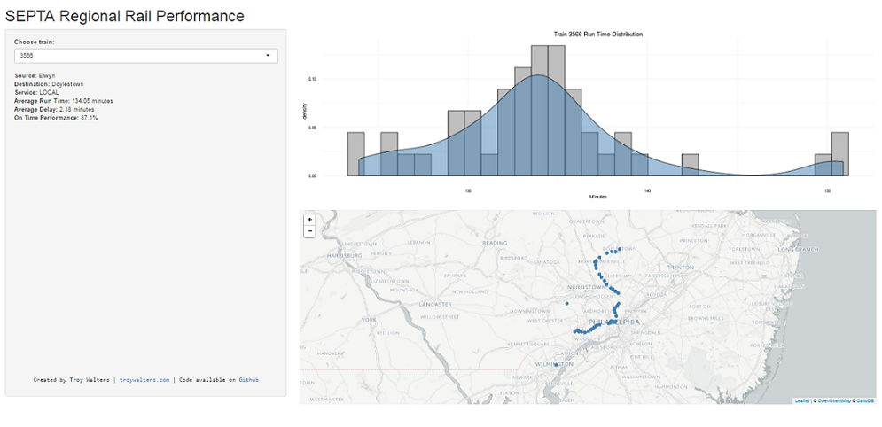

## The Data

* The Southeastern Pennsylvania Transportation Authority (SEPTA) recently made a dataset available on kaggle.com. This dataset contains performance data for SEPTA's regional rail system. 

* Due to the dataset being very large and there being a large number of trains, it made sense to develop a simple app that could show for each train it average runtime, locations, and on-time performance. 

* I first performed some processing of the raw data in which I calculated the run times of each train each day. This resulted in a processed data set that sits underneath the Shiny app. You can find the code that I used to preprocess in the github [repository](https://github.com/capt-calculator/septaApp).

* The data set contains data from March 23, 2016 through May 30, 2016.

---

## Components of the Application

The Shiny application consists of three main parts:

1. Performance information for the selected train
2. A histogram/density plot of the selected train's run times
3. An interactive leaflet map showing the train's measured locations


--- .class #id 

## Train Run Times

A selected train's run times are show as a histsogram and density plot:

```{r, message=FALSE, echo=FALSE, fig.align='center', fig.width=10}
library(data.table)
library(dplyr)
library(ggplot2)

runTimes  <- fread('c:/users/zne35671/dropbox/coursera_ddp/septaApp/runTimes.csv')

runTimes %>% 
    filter(train_id=='9216') %>% 
    ggplot(aes(x=delta)) + 
    geom_histogram(aes(y=..density..), color='black', fill='gray') +
    geom_density(fill='steelblue', alpha=0.5) +
    xlab('Minutes') +
    ggtitle('Train 9206 Run Time Distribution')
    

```

---

## Final Product

A screenshot of the actual Shiny application, which also includes an interactive leaflet map:



